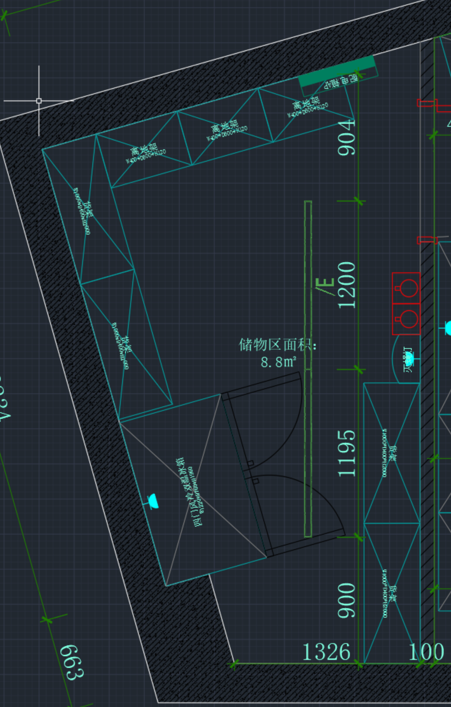
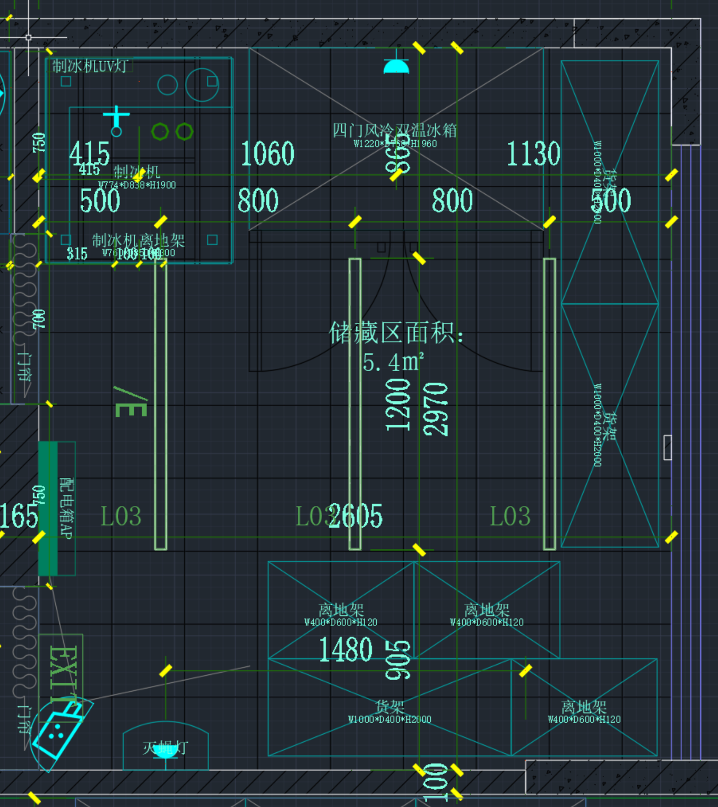
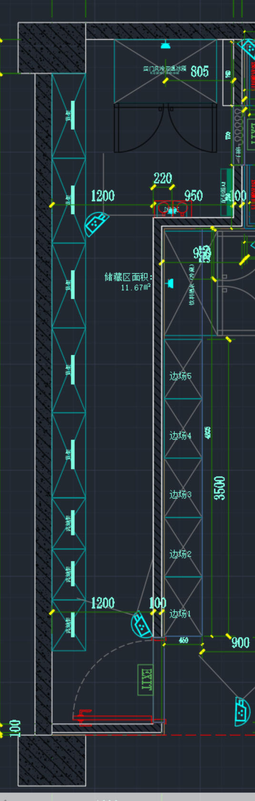
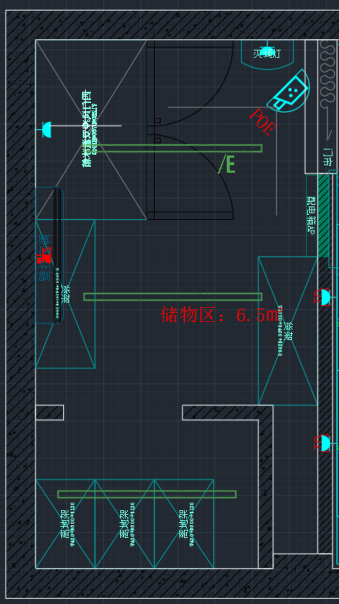

# 居灵 TakeHome工程题 - 二维多边形内矩形放置

## AI工具使用说明

1. **使用的AI工具**: OpenCode (opencode/mimo-v2.5-free)
2. **AI主要帮助的部分**: 
   - 思路拆解：将复杂的二维矩形包装问题分解为几何计算、碰撞检测、候选位置生成、贪心放置等模块
   - 代码生成：实现多边形点在多边形内检测、线段相交检测、矩形碰撞检测等核心几何算法
3. **自己理解并调整的部分**:
   - 贪心放置策略的评分函数设计（墙壁接触优先、物品接触次之）
   - 冰箱开门边清空区域的计算逻辑
   - 内开门门区域的向内延伸计算方向判断

## 核心代码实现逻辑说明

### 问题定义
给定一个多边形轮廓、一个门的位置（含内外开类型）和若干矩形物品，将物品不重叠地放置在轮廓内，物品可旋转但必须轴对齐（0°或90°）。

### 算法流程

1. **输入解析**：读取JSON格式的边界多边形、门位置、物品尺寸
2. **门区域计算**：若内开门，根据门宽计算向内延伸的N×N障碍区域
3. **贪心放置**（按面积从大到小排序）：
   - **候选位置生成**：沿轮廓边生成贴墙候选位置 + 多边形内部随机位置
   - **合法性验证**：矩形完全在多边形内、不与门区域重叠、不与已放物品重叠
   - **冰箱特殊约束**：开门边（length边）前方需保留300mm清空区域
   - **评分选择**：墙壁接触数×100 + 已放物品接触数×50 - 到中心距离×0.01
4. **输出**：可行性结果 + 每个物品的中心坐标、尺寸、旋转角度

### 关键几何算法

| 算法 | 说明 |
|------|------|
| 点在多边形内 | Ray Casting（射线法） |
| 线段相交检测 | 方向判定法（Orient + OnSegment） |
| 矩形在多边形内 | 四角点检测 + 边无交叉检测 |
| 矩形重叠检测 | 分离轴投影法（AABB） |
| 边法线计算 | 基于多边形顶点顺序的内向法线 |

## 运行环境及运行方式

### 环境要求
- Python 3.6+
- 无需第三方依赖（纯标准库实现）

### 运行方式
```bash
# 在项目目录下执行
python solver.py
```

程序将自动处理 `example1.json` ~ `example4.json`，并将结果输出到对应的 `output1.json` ~ `output4.json`。

### 单独处理某个文件
在代码中修改 `__main__` 部分，或在Python中调用：
```python
from solver import solve
success, placements = solve("example1.json")
```

## 既定输入的输出示例

### Example 1
- 输入：8个物品（1冰箱 + 1制冰机 + 3货架 + 3离地架）
- 输出：**FEASIBLE** - 全部8个物品成功放置
- 冰箱中心：(6508.10, 30985.56)，旋转0°



### Example 2
- 输入：8个物品（1冰箱 + 4货架 + 3离地架）
- 输出：**FEASIBLE** - 全部8个物品成功放置
- 冰箱中心：(29608.39, 34296.83)，旋转0°



### Example 3
- 输入：9个物品（1冰箱 + 5货架 + 3离地架），含内开门
- 输出：**FEASIBLE** - 全部9个物品成功放置
- 内开门门宽700mm，产生700×700mm障碍区域
- 冰箱中心：(56578.29, 36100.24)，旋转90°



### Example 4
- 输入：6个物品（1冰箱 + 2货架 + 3离地架）
- 输出：**FEASIBLE** - 全部6个物品成功放置
- 冰箱中心：(183543.59, 31262.38)，旋转90°



## 文件结构
```
居灵-TakeHome工程题/
├── solver.py              # 核心算法代码
├── README.md              # 本文档
├── 输入示例/              # 输入数据目录
│   ├── example1.json
│   ├── example2.json
│   ├── example3.json
│   ├── example4.json
│   ├── image01.png        # Example1 CAD平面布置图
│   ├── image02.png        # Example2 CAD平面布置图
│   ├── image03.png        # Example3 CAD平面布置图
│   └── image04.png        # Example4 CAD平面布置图
└── 输出示例/              # 输出结果目录
    ├── output1.json
    ├── output2.json
    ├── output3.json
    └── output4.json
```
